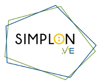
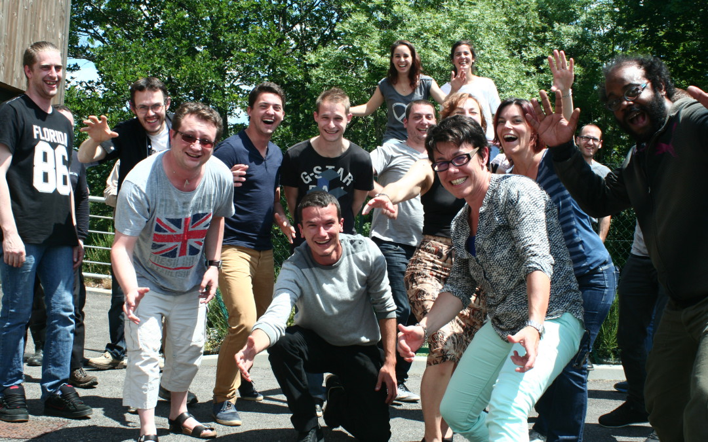
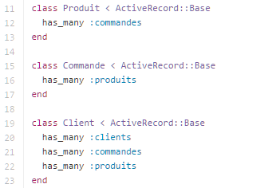
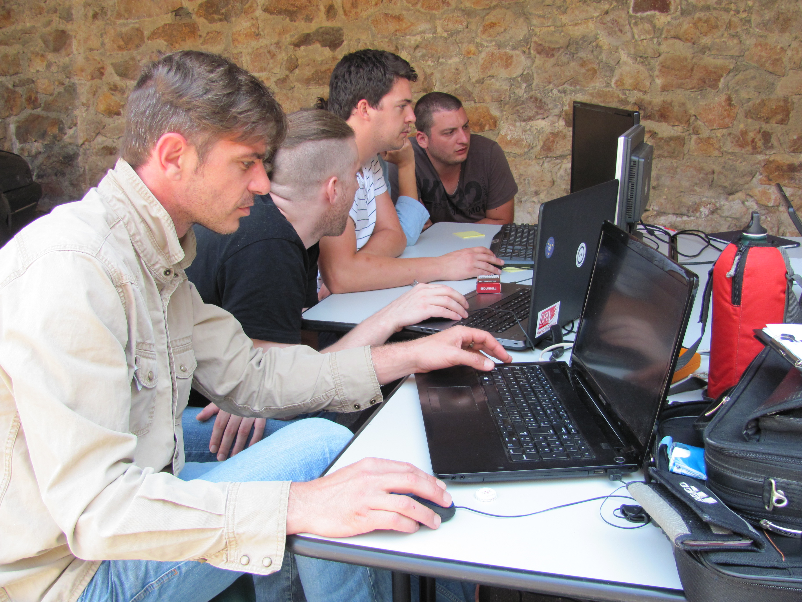
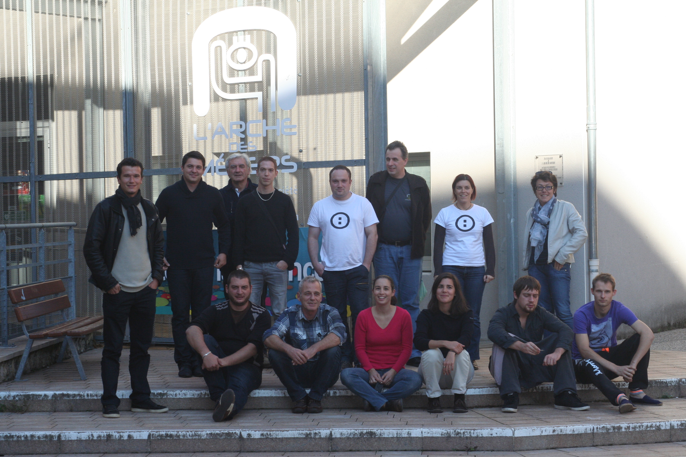
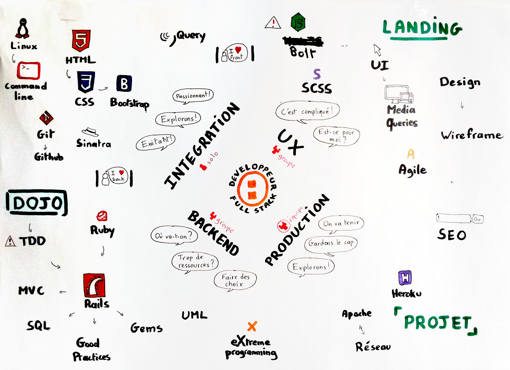
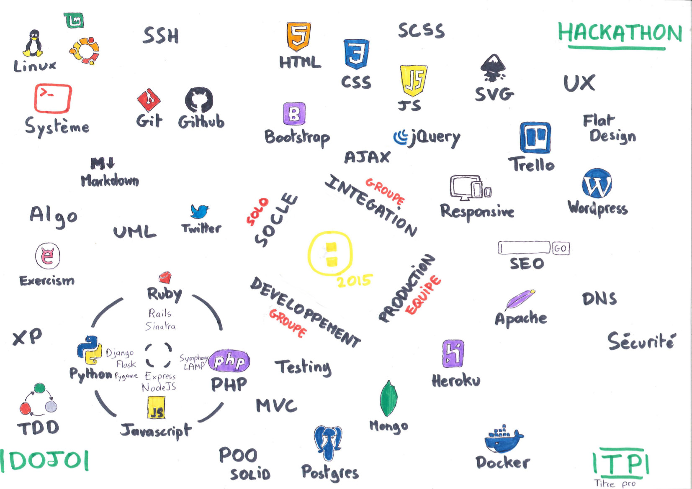
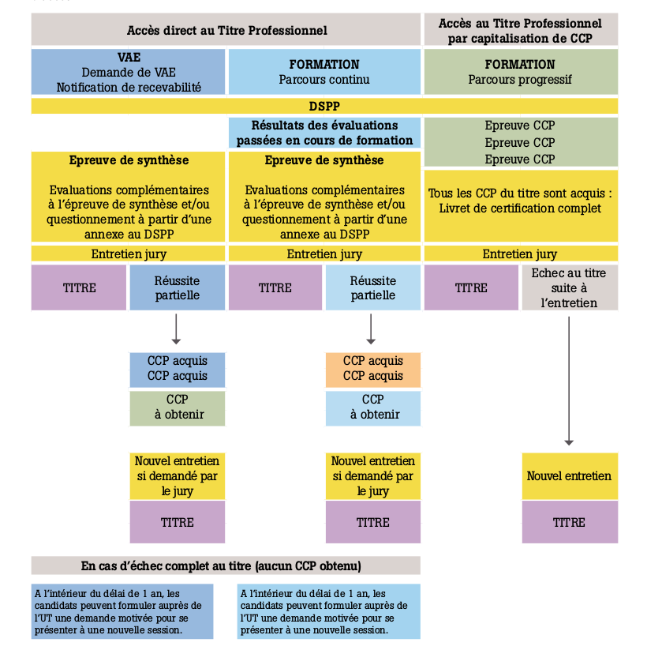

##Promo#1 Simplon.VE
Avril-Octobre 2015

===
###Qui est Simplon.VE ?
///
20 apprentis développeurs

///
- 84% de demandeurs d'emplois
- 75% diplomés inférieurs ou = BAC+2
- 25% de femmes
- 38 ans de moyenne d'âge
- 80% d'Ardéchois
///

- 840h de formation (6 mois, temps plein)
- 2 projets pro à réaliser auprès de professionnels locaux
- 70h de stage en alternance
///
Des milliers de ligne de code (+5000)

///

- 25+ intervenants hebdomadaires 
    - développeurs, entrepreneurs, consultants, enseignants
- Conférences, Meetup 
    - Valence, StEtienne, Lyon, Romans

- KidsCoding, 
- RailsGirls, 
- Simplonsmus, 
- HackElysée,
- Portes Ouvertes Poleyrieux

///
Hackathon | Marathon numérique

St Martin de Valamas, le 19 Août 2015
    -> Data Tourisme 

///
Hackathon | Marathon numérique
Le Cheylard, Arche des Métiers, le 29 Septembre 2015
    -> Data Agroalimentaire 

===
###Une formation professionnelle intégrée dans un monde nouveau
///
###Objectifs
 - **Intégrer professionnellement** des personnes en situation de retour à l'activité
 - Identifier les technologies existantes et émergentes et leurs marchés d’application
 - Comprendre les habitudes, tendances et besoins des entreprises et de la société
///
### Notre ADN 
 - Collaboration et autonomie des apprenants
 - Savoir-être => développeur sociable
 - Evolution des compétences par la pratique | projet
 - Choix accompagnés dans les apprentissages

===

###Un programme chargé

3 parcours : basés sur [OpenClassroom](https://openclassrooms.com/learning-paths/)
- Développeur logiciel
- Intégrateur web
- Animateur d'équipe | chef projet
///
Choix d'apprentissage non-linéaire, systémique

///
Co-construction | Au 20 octobre | mois +6

===
##Bilan au 27 octobre
///
Sorties positives liées à la formation

- 40% - Entrepreneurs (création d'activité)
- 10% - Salariés (CDD)
- 10% - Formations (sécurité, Java)
- 10% - Associatifs (logiciels libres, animation)
- 30% - ?

===
###Au printemps 2016
L'après promo#1
///
###Titre professionnel
- Labo.VE agrégée organisme de formation
- Certificat "Développeur Logiciel" reconnu par l'Etat | équivalent BAC+2
- Passage de l'épreuve devant un jury externe début 2016

===
 - 30-40% promo#1 le TP => espace d'examen Poleyrieux
 - Création d'un pole numérique Val'Eyrieux
 - Quels liens forger avec les entrepreneurs locaux ?

///
###Un modèle en constante évolution
Pistes potentielles
 - atelier 30 heures / 2 mois lean-agile pour cadre
 - cours du soir sur la programmation pour salarié
 - summer camp pour développeurs Lyonnais

///
#Sky is the limit !
