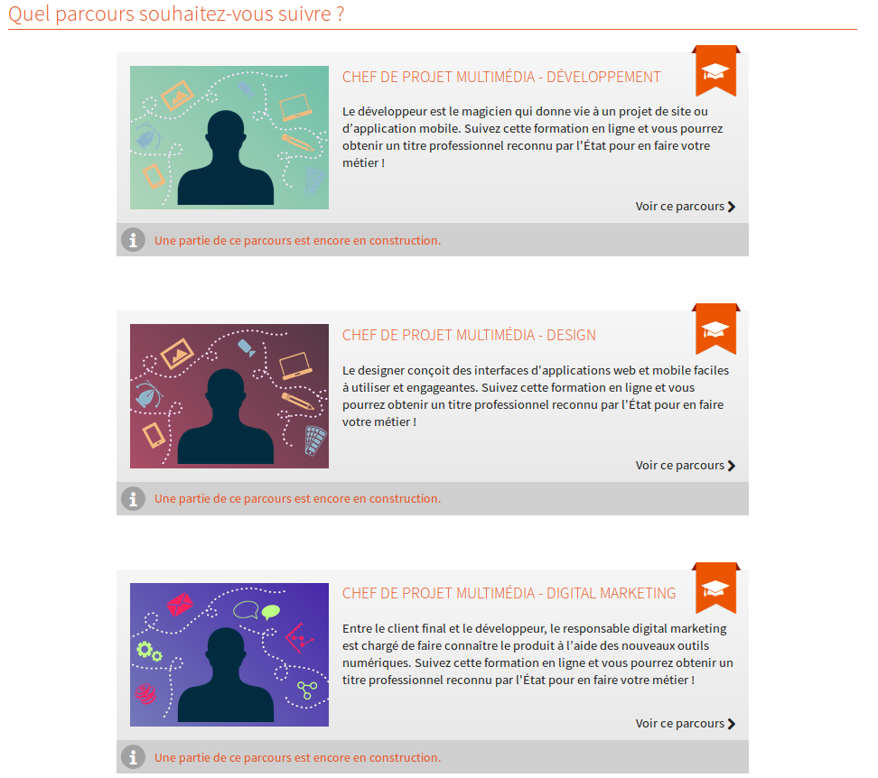
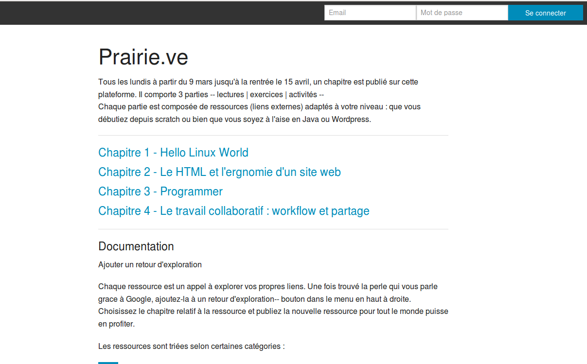

##Promo#1 Simplon.VE
Avril-Octobre 2015
###Bilan à mi-parcours
===
###Qui est Simplon.VE ?
///
20 apprentis développeurs

///
- 840h de formation (6 mois)
- 20 PCs mis à disposition
- Encadrement : 1 personnes à temps plein, 2 à mi-temps
///
Parmi les Simploniens
- 84% de demandeurs d'emplois
- 75% diplomés inférieurs ou = BAC+2
- 25% de femmes
- 38 ans de moyenne d'âge
- 80% d'Ardéchois
///
- 2 projets pro à réaliser
- 70h de stage en alternance
===
###Une pédagogie innovante
///
Objectifs généraux
 - Identifier les technologies existantes et émergentes et leurs marchés d’application
 - Comprendre les habitudes, tendances et besoins des entreprises et de la société
 - Mettre en application les techniques et processus d’innovation

===
####Méthodes agiles [cf. agilemanifesto.org]

- Une production de solutions logicielles d'abord garantie par les interactions humaines. 
- La réalisation de prototypes (MVP) accroit le dialogue avec les clients et s'adapte vite à la demande.    
===
###Une formation orienté projets 
Mettre en situation les étudiants par le développement d'équipe sur des projets de développement de site web.
///
Basé sur l'autonomie des étudiants
 - inspiré de la méthode Frenet adapté aux adultes
 - évolution par la pratique
 - Coaching individuel et collectif
 - Dynamique de groupe

///
Objectifs :
  - Identifier les avantages et les améliorations que procure l’adoption de nouvelles technologies
  - Créer un Poc (Proof of Concept – preuve du concept)
  - Penser sans idées préconçues
  - Identifier les bonnes ressources

===
###Un programme chargé !
///
3 parcours : basé sur [OpenClassroom](https://openclassrooms.com/learning-paths/)

///
- Développeur
- Intégrateur (fork)
- Chef projet
///
Choix d'apprentissage à la carte

///
Co-construction après 4 mois

===
###Un accompagnement coaching 
///
Coaching individuel

- clarification de l'objectif professionnel
- focus sur les talents pour booster cet objectif
- sur les valeurs pour le nourrir et un engagement de la part du coaché qui doit faire sens par rapport à son identité personnelle et professionnelle. 

///
Coaching collectif

- permettre au groupe d'être rapidement en mode participatif
- puis en autonomie et enfin en autorégulation
- dans une dynamique de confiance et d'interaction.

///
Coaching de performance 

- accompagner les étudiants à passer d'une posture de demandeurs d'emploi à développeurs numériques en capacité d'offrir des compétences et des ressources sur le marché. 
===
### 6 mois... plus ou moins
///
###avant: Prairie.VE

https://github.com/simplonve/prairieve

///
- Dès le recrutement (un mois avant le premier jour)
- plus de 200 liens divisés en 5 chapitres
- livraison hebdomadaire par chapitre
///
###après: Titre professionnel
- L'association Simplon.VE agrégée organisme de formation
- Certificat reconnu par l'Etat (Equivalent BAC+2)
- Passage de l'épreuve devant un jury externe en février 2016

===
